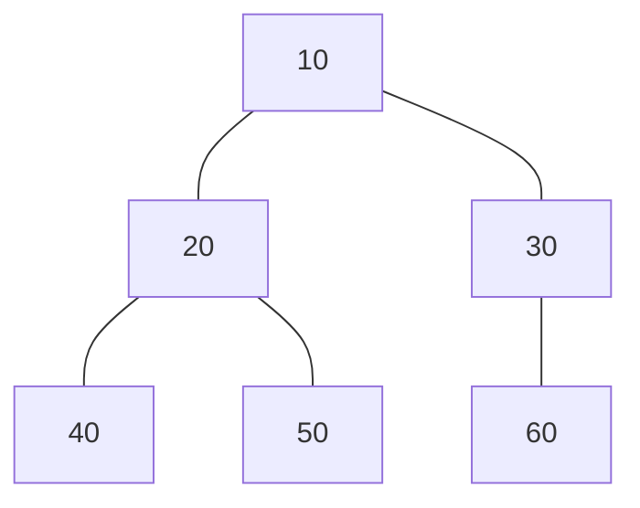
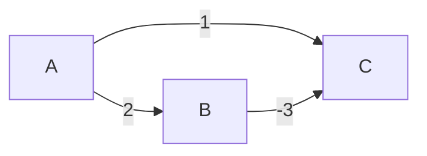

# Graphs

## Activity 1

### Task 1 — Theoretical Graph

The graph used in this assignment is an undirected graph with 6 nodes:



This is implemented as an undirected graph — each edge is stored in both directions.

---

### Task 2 — BFS and DFS in C++

Two implementations are provided:

- [**ListGraph**](./src/graph/list_graph.cpp) — adjacency list using `unordered_map<int, Node*>` and a `neighbors` set on each node.
- [**MatrixGraph**](./src/graph/matrix_graph.cpp) — adjacency matrix using a 2D `vector<vector<int>>` and an `idToIndex` map.

Both support `bfs(startId, target)` and `dfs(startId, target)` through the shared `Graph` interface.

**Sample output:**

```bash
=== Adjacency List (ListGraph) ===
BFS from 10: search for 50 -> found
BFS from 10: search for 99 -> not found
DFS from 10: search for 50 -> found
DFS from 10: search for 99 -> not found

=== Adjacency Matrix (MatrixGraph) ===
BFS from 10: search for 50 -> found
BFS from 10: search for 99 -> not found
DFS from 10: search for 50 -> found
DFS from 10: search for 99 -> not found
```

---

### Task 3 — Big O Comparison

| Structure          | BFS Time   | DFS Time    | Space       |
| ------------------ | ---------- | ----------- | ----------- |
| Graph (adj list)   | $O(V + E)$ | $O(V + E)$  | $O(V)$      |
| Graph (adj matrix) | $O(V^2)$   | $O(V^2)$    | $O(V)$      |
| Tree               | $O(V)$     | $O(V)$      | $O(V)$      |
| BST (balanced)     | $O(V)$     | $O(\log n)$ | $O(\log n)$ |
| BST (unbalanced)   | $O(V)$     | $O(V)$      | $O(V)$      |

Where **V** = number of vertices and **E** = number of edges.

**Why the difference between the graphs?**  
With an adjacency list, visiting a node's neighbors costs O(degree) — we only look at edges that actually exist. With an adjacency matrix, finding a node's neighbors always requires scanning an entire row of length V, even if most entries are 0. Over all V nodes that gives $O(V²)$.

**BFS vs DFS trade-offs:**  
Both have the same general time complexity. The practical difference is in traversal order and memory usage:

- BFS explores layer by layer and is guaranteed to find the shortest path (in terms of edges) in an unweighted graph. It keeps a queue that can hold up to $O(V)$ nodes at its widest point.
- DFS explores as deep as possible before backtracking. It uses the call stack (or an explicit stack), which is at most $O(V)$ deep. DFS is generally preferred when you only need to know if a path exists and the graph is deep rather than wide.

---

## Activity 2 — Why Dijkstra's Algorithm Fails on Negative Weights

### The Core Assumption

Dijkstra's algorithm uses a greedy strategy: when a node is popped from the min-priority queue, it is finalized — the algorithm assumes no shorter path to it can ever be found. This invariant holds only when all edge weights are non-negative, because adding more edges to a path can only increase (or at worst maintain) the total cost.

A negative edge breaks this guarantee: a path discovered later can be shorter than one already finalized.

### Example

Consider this weighted directed graph:



The shortest path from A to C is $A → B → C = 2 + (−3) = −1$.  
But Dijkstra's algorithm produces the wrong answer:

| Step           | Action                                                   | dist[A] | dist[B]  | dist[C]       |
| -------------- | -------------------------------------------------------- | ------- | -------- | ------------- |
| Init           | —                                                        | 0       | $\infin$ | $\infin$      |
| Pop A (cost 0) | Relax neighbors                                          | 0       | 2        | 1             |
| Pop C (cost 1) | **Finalize C** — no outgoing edges                       | 0       | 2        | **1** ← wrong |
| Pop B (cost 2) | Try to update $C: 2+(−3)=−1$, but C is already finalized | —       | —        | —             |

Because C's direct edge from A (cost 1) is cheaper than B's (cost 2), Dijkstra finalizes C before ever processing B. Once C is finalized, the shorter path via B's negative edge is ignored.

### Why the Fix Is Non-Trivial

Simply "not finalizing" nodes early would require re-processing nodes that were already settled, which removes the algorithm's $O((V + E) log V)$ guarantee and can lead to infinite loops if there are negative cycles.

---

## Sources

GeeksforGeeks. (2026, January 21). Dijkstra's shortest path algorithm: Greedy algorithm. https://www.geeksforgeeks.org/dsa/dijkstras-shortest-path-algorithm-greedy-algo-7/

d-khan. Graphs [Lecture notes]. GitHub. https://github.com/d-khan/dslabs/blob/main/graphs/Lecture.md
